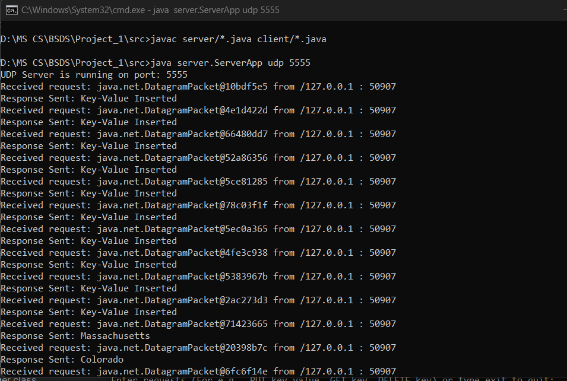
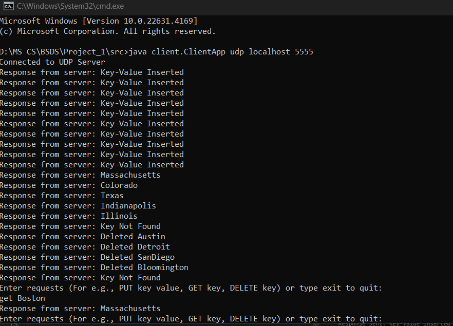
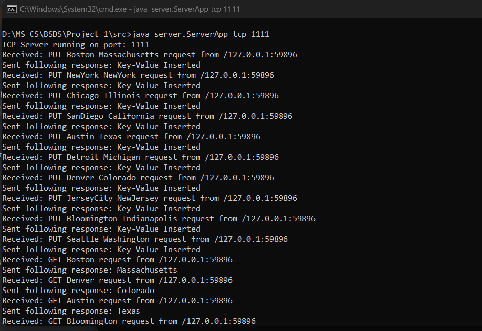
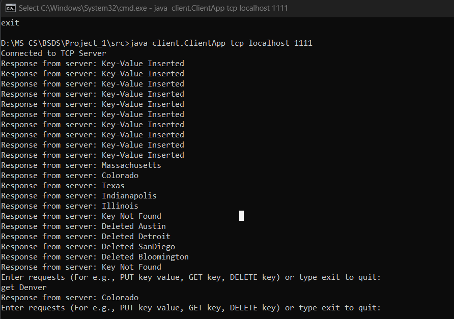

## Single Thread Client-Server Application Key-Value Store

### Project Structure: 

```bash
src
├── Dockerfile
├── Readme.md
├── Executive_Summary.docx
├── client
│   ├── Client.java
│   ├── ClientApp.java
│   ├── ClientLogger.java
│   ├── TCPClient.java
│   └── UDPClient.java
└── server
    ├── AbstractHandler.java
    ├── KeyValue.java
    ├── Response.java
    ├── ServerApp.java
    ├── ServerLogger.java
    ├── TCPHandler.java
    └── UDPHandler.java
```
### Accepted Data Types:
#### Key: String (Non-Numeric and Non-Boolean characters only)
#### Value: String (Non-Numeric and Non-Boolean characters only)

#### Data stored on the server: Key = City Name, Value = State
##### Example: Key = Boston, Value = Massachusetts

### Commands For Client
1. PUT: `PUT key value`
2. GET: `GET key`
3. DELETE: `DELETE key`

### Log File Location: 
1. Client: `src/client/log/client.log`
2. Server: `src/server/log/server.log`

### Steps to run the application:
### With Docker:
1. Open Command Prompt or Terminal in `src` folder where `Dockerfile` is located. Open docker desktop as well. 
2. Create an image for TCP and UDP Server using following commands:  
    `docker build -t server-image-tcp --target server-build-tcp .`  
    `docker build -t server-image-udp --target server-build-udp .`
3. Create an image for Client using following command:  
   `docker build -t client-image --target client-build .`
4. Create a network using following command:  
   `docker network create project-network`
5. Now run TCP Server and TCP Client using following commands:  
   `docker run -p 1111:1111/tcp --name server-container-tcp --network project-network server-image-tcp`  
   Open Another Command Prompt or Terminal in same `src` folder and enter the command:  
   `docker run -it --rm --name client-container --network project-network client-image java client.ClientApp tcp server-container-tcp 1111`  
    This should start the server and client. Client would be in interactive mode. 
6. Now run UDP Server and UDP Client using following commands:  
   `docker run -p 5555:5555/udp --name server-container-udp --network project-network server-image-udp`  
   Open Another Command Prompt or Terminal in same `src` folder and enter the command:  
   `docker run -it --rm --name client-container-udp --network project-network client-image java client.ClientApp udp server-container-udp 5555`  
   This should start the server and client. Client would be in interactive mode. 


### Without Docker
1. Open Command Prompt or Terminal in `src` folder where client and server packages are located. 
2. Run following command: `javac server/*.java client/*.java` to compile the code.
3. Run the server using following command: `java server.ServerApp <protocol> <port-number>`  
    Example: For TCP: `java server.ServerApp tcp 1111`, For UDP: `java server.ServerApp udp 5555`
4. Run the client using following command: `java client.ClientApp <protocol> <host-name> <port-number>`  
    Example: For TCP: `java client.ClientApp tcp localhost 1111`, For UDP: `java client.ClientApp udp localhost 5555`
5. This should start the server and client. Client would be in interactive mode.

### Screenshots of Application on Local Environment:
#### UDP Server: 

#### UDP Client:

#### TCP Server: 

#### TCP Client:

